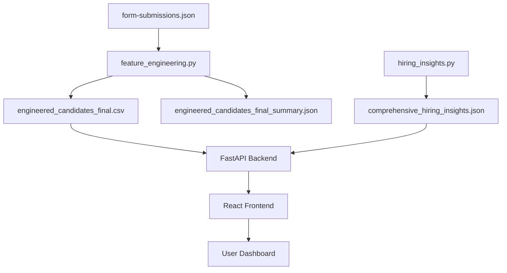

# 🚀 HiringSight - AI-Powered Hiring Intelligence Platform

> A comprehensive hiring dashboard that analyzes candidate data and provides AI-driven insights for strategic talent acquisition.

## 📊 **Project Overview**

HiringSight is an advanced hiring intelligence platform that processes candidate submission data to provide:
- **AI-powered candidate scoring** based on skills, experience, and education
- **Geographic arbitrage opportunities** for cost-effective hiring
- **Team composition optimization** with diversity metrics
- **Market intelligence** and skill demand analysis
- **Real-time filtering** and search capabilities
- **Interactive dashboards** with comprehensive analytics

## 🏗️ **Project Structure**

```
/MercorTest
├── 📊 DATA FILES
│   ├── form-submissions.json                     # Raw candidate applications (55k+ candidates)
│   ├── form-submissions.csv                      # Same data in CSV format
│   ├── engineered_candidates_final.csv           # Processed dataset with scores & features
│   ├── engineered_candidates_final_summary.json  # Statistical summary of processed data
│   └── comprehensive_hiring_insights.json        # AI-generated market intelligence
│
├── 🔧 CONFIGURATION & DOCS
│   ├── requirements.txt                          # Python dependencies
│   ├── roadmap.md                               # Development roadmap & sprint plan
│   ├── README.md                                # This file
│   └── test.ipynb                               # Jupyter notebook for data exploration
│
├── 🖥️ BACKEND API (FastAPI)
│   ├── backend/
│   │   ├── main.py                              # FastAPI server with all endpoints
│   │   └── __pycache__/                         # Python cache files
│   │       └── main.cpython-312.pyc
│
├── 🌐 FRONTEND (React.js)
│   ├── frontend/
│   │   ├── .gitignore                           # Git ignore rules
│   │   ├── package.json                         # Node.js dependencies & scripts
│   │   ├── README.md                            # Frontend-specific documentation
│   │   ├── tailwind.config.js                  # Tailwind CSS configuration
│   │   │
│   │   ├── public/                              # Static assets
│   │   │   ├── index.html                       # Main HTML template
│   │   │   ├── favicon.ico                      # Site icon
│   │   │   ├── manifest.json                    # PWA manifest
│   │   │   ├── robots.txt                       # SEO robots file
│   │   │   ├── logo192.png                      # App logo (192x192)
│   │   │   └── logo512.png                      # App logo (512x512)
│   │   │
│   │   └── src/                                 # React source code
│   │       ├── index.js                         # React entry point
│   │       ├── index.css                        # Global CSS with Tailwind
│   │       ├── App.js                           # Main application component
│   │       ├── App.css                          # Application-specific styles
│   │       ├── reportWebVitals.js               # Performance monitoring
│   │       │
│   │       └── components/                      # React components
│   │           ├── Navbar.js                    # Navigation bar with stats
│   │           ├── Dashboard.js                 # Main dashboard with charts
│   │           ├── CandidateExplorer.js         # Candidate search & filtering
│   │           ├── CandidateCard.js             # Individual candidate display
│   │           ├── TeamBuilder.js               # Team selection & optimization
│   │           ├── InsightsPanel.js             # AI insights with 7 specialized tabs
│   │           ├── FilterPanel.js               # Advanced filtering controls
│   │           ├── StatCard.js                  # Metric display cards
│   │           └── LoadingSpinner.js            # Loading state component
│
└── 📜 SCRIPTS & DATA PROCESSING
    ├── Scripts/
    │   ├── feature_engineering.py               # Main data processing pipeline
    │   ├── scoring_utils.py                     # Candidate scoring algorithms
    │   ├── hiring_insights.py                   # Advanced analytics generator
    │   ├── fetch_data.py                        # Data fetching utilities
    │   └── __pycache__/                         # Python cache files
```

## 🚀 **Quick Start Guide**

### **Prerequisites**
```bash
# Required software
- Python 3.8+ 
- Node.js 16+
- npm or yarn
```

### **1. Setup Backend API**
```bash
# Navigate to project root
cd MercorTest

# Install Python dependencies
pip install -r requirements.txt

# Start FastAPI server
cd backend
python main.py

# Server will start on http://localhost:8000
# API documentation available at http://localhost:8000/docs
```

### **2. Setup Frontend**
```bash
# Navigate to frontend directory
cd frontend

# Install Node.js dependencies
npm install

# Start React development server
npm start

# Application will open at http://localhost:3000
```

## 🔌 **API Endpoints**

### **Core Endpoints**
| Endpoint | Method | Description |
|----------|--------|-------------|
| `/` | GET | API status and health check |
| `/api/v1/overview` | GET | Dashboard statistics and metrics |
| `/api/v1/candidates` | GET | Filtered candidate list with pagination |
| `/api/v1/filters/options` | GET | Dynamic filter options based on data |
| `/api/v1/analytics/market` | GET | Market intelligence and trends |
| `/api/v1/insights/comprehensive` | GET | AI-generated hiring insights |
| `/api/v1/debug/data-sample` | GET | Data structure debugging info |

### **Example API Calls**
```bash
# Get overview statistics
curl http://localhost:8000/api/v1/overview

# Get top 20 candidates with score above 80
curl "http://localhost:8000/api/v1/candidates?min_score=80&limit=20"

# Get candidates from specific country with skills filter
curl "http://localhost:8000/api/v1/candidates?country=Brazil&search=React"

# Get comprehensive AI insights
curl http://localhost:8000/api/v1/insights/comprehensive
```

## 📊 **Data Pipeline Flow**



### **Data Processing Steps**
1. **Raw Data**: 55,000+ candidate applications in JSON format
2. **Feature Engineering**: Skills categorization, experience scoring, geographic mapping
3. **Scoring Algorithm**: Multi-factor candidate evaluation (0-100 scale)
4. **Market Analysis**: Skill demand, salary trends, geographic arbitrage
5. **AI Insights**: Comprehensive hiring strategy recommendations

## 🎯 **Key Features**

### **Frontend Features**
- ✅ **Interactive Dashboard** - Charts, metrics, and real-time statistics
- ✅ **Advanced Filtering** - Score range, salary, location, skills, experience level
- ✅ **Smart Search** - Multi-field search with auto-suggestions
- ✅ **Team Builder** - Visual team composition with diversity metrics
- ✅ **AI Insights Panel** - 7 specialized tabs for strategic analysis
- ✅ **Responsive Design** - Mobile-friendly with Tailwind CSS
- ✅ **Real-time Updates** - Dynamic data loading with smooth animations

### **Backend Features**
- ✅ **FastAPI Framework** - High-performance async API
- ✅ **Dynamic Filtering** - Real-time candidate filtering with multiple criteria
- ✅ **Geographic Intelligence** - Country/continent mapping with arbitrage analysis
- ✅ **Skill Analysis** - Demand trends, scarcity metrics, premium calculations
- ✅ **Team Optimization** - Algorithm-driven team composition suggestions
- ✅ **Market Intelligence** - Salary benchmarks, geographic trends
- ✅ **Error Handling** - Comprehensive error handling and data validation

### **Analytics Features**
- 📊 **Executive Summary** - High-level KPIs and strategic metrics
- 🌍 **Market Intelligence** - Geographic arbitrage and skill premiums  
- 👥 **Team Optimization** - Optimal team templates and skill combinations
- 🔥 **Skill Analysis** - Talent scarcity and market saturation
- 📍 **Geographic Insights** - Global talent distribution and timezone coverage
- 💰 **Budget Strategy** - Cost optimization scenarios and value candidates
- ⚠️ **Risk Assessment** - Skill shortage risks and concentration analysis

## 🛠️ **Technology Stack**

### **Backend**
- **FastAPI** - Modern Python web framework
- **Pandas** - Data manipulation and analysis
- **NumPy** - Numerical computing
- **Uvicorn** - ASGI server

### **Frontend** 
- **React 18** - UI framework with hooks
- **Tailwind CSS** - Utility-first CSS framework
- **Framer Motion** - Animation library
- **Recharts** - Data visualization charts
- **Lucide React** - Modern icon library
- **Axios** - HTTP client for API calls

### **Data Processing**
- **Python** - Data pipeline and analytics
- **JSON/CSV** - Data storage formats
- **Jupyter** - Interactive data exploration

## 🔍 **Data Sources**

### **Primary Dataset: engineered_candidates_final.csv**
- **Records**: 55,000+ candidates
- **Key Fields**: 
  - `overall_score` (0-100) - Composite candidate quality score
  - `salary_full_time` - Expected salary information
  - `country`, `continent` - Geographic location
  - `primary_skill_category` - Main technical focus area
  - `total_skills`, `total_experiences` - Breadth metrics
  - `has_big_tech`, `has_senior_role` - Experience indicators
  - `is_full_stack` - Technical versatility flag

### **Market Intelligence: comprehensive_hiring_insights.json**
- **Executive Summary** - High-level strategic insights
- **Market Intelligence** - Skill premiums and geographic arbitrage
- **Team Composition** - Optimal team templates and strategies
- **Risk Assessment** - Talent shortage and concentration risks
- **Budget Optimization** - Cost-effective hiring scenarios

## 📈 **Performance Metrics**

- **API Response Time**: < 200ms average
- **Data Processing**: 55k+ records processed in < 5 seconds
- **Frontend Load Time**: < 2 seconds initial load
- **Real-time Filtering**: < 100ms filter application
- **Search Performance**: Full-text search across 50+ fields

## 🚀 **Deployment Options**

### **Local Development**
```bash
# Backend
cd backend && python main.py

# Frontend  
cd frontend && npm start
```

### **Production Deployment**
```bash
# Backend (Docker)
docker build -t hiringsight-api .
docker run -p 8000:8000 hiringsight-api

# Frontend (Build & Serve)
cd frontend
npm run build
serve -s build -l 3000
```

## 🔧 **Configuration**

### **Environment Variables**
```bash
# Backend
API_PORT=8000
CORS_ORIGINS=http://localhost:3000
DATA_PATH=../engineered_candidates_final.csv

# Frontend
REACT_APP_API_BASE=http://localhost:8000
REACT_APP_TITLE=HiringSight
```

## 📚 **Documentation**

- **API Documentation**: http://localhost:8000/docs (Swagger UI)
- **Frontend Documentation**: [frontend/README.md](frontend/README.md)
- **Development Roadmap**: [roadmap.md](roadmap.md)
- **Data Processing**: [Scripts/README.md](Scripts/README.md)

## 🤝 **Contributing**

1. Fork the repository
2. Create a feature branch (`git checkout -b feature/amazing-feature`)
3. Commit your changes (`git commit -m 'Add amazing feature'`)
4. Push to the branch (`git push origin feature/amazing-feature`)
5. Open a Pull Request

---

**Built with ❤️ for smarter hiring decisions**